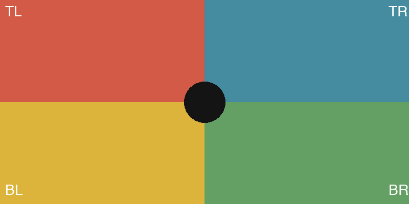
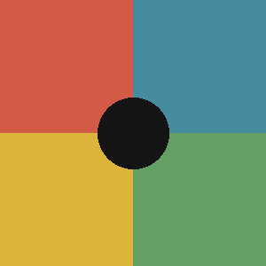
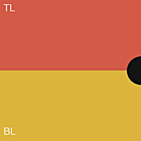
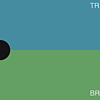

# Fit-Modi

us-mediakit unterstützt vier Zuschnitt-/Skalierungsmodi, portiert aus der bisherigen
PHP-Bildbibliothek (`SimpleImageLibrary3`), damit bestehende Presets (`imageformats.json`)
unverändert weiterverwendet werden können. Alle Beispiele unten nutzen dieses
800×400-Testbild:



## `crop`

Schneidet exakt `w`×`h` an der konfigurierten Position aus — **ohne** vorher zu skalieren.
Ist die Quelle kleiner als `w`×`h`, bleibt der Ausschnitt entsprechend unvollständig.
Für ein Preset `{"w": 300, "h": 300, "fit": "crop", "xalign": "center", "yalign": "center"}`:



Anwendungsfall: wenn die Quelle bereits verlässlich groß genug ist und ein einfacher,
performanter Zuschnitt ohne Skalierungsaufwand reicht.

## `greedycrop`

Skaliert die Quelle zunächst so, dass beide Zielmaße *garantiert* erreicht werden — dabei
wird das Seitenverhältnis bewusst leicht verzerrt (siehe Quellcode-Kommentar in
`core/transform.py` für die genaue Formel), damit der anschließende Zuschnitt nie über den
Bildrand hinausgeht. Gleiches Preset wie oben, nur `"fit": "greedycrop"`:


Das ist bestehendes Verhalten aus der PHP-Bibliothek, keine neue Entscheidung — die leichte
Verzerrung im Zwischenschritt ist ein bekannter Kompromiss zugunsten von Einfachheit/Robustheit,
kein Fehler, der hier zu beheben wäre.

## `greedyscalecrop` / `full`

Der Standardfall für die meisten Presets: Zuerst wird ein Ausschnitt mit dem **Zielseitenverhältnis**
aus der Quelle geschnitten (zentriert oder nach `xalign`/`yalign` verschoben, siehe unten), danach
wird dieser Ausschnitt auf die Zielgröße skaliert. `greedyscalecrop` und `full` verhalten sich
identisch — der Name unterscheidet nur, ob der Aufrufer explizit einen Zuschnitt wollte oder
das Preset von sich aus so konfiguriert ist.


**Wichtige Einschränkung:** Ist die Zielgröße größer als die Quelle (`scale > 1`) und ist
**kein** `ai`-Provider angegeben, wird standardmäßig **nicht** vergrößert — das Ergebnis
bleibt kleiner als angefragt. Grund: Eine reine bikubische Vergrößerung ist nicht das
gewünschte Standardverhalten, sondern nur mit einem konfigurierten KI-Upscaling-Provider
wirklich scharf (siehe [`providers.md`](providers.md)). Die CLI weist beim Auftreten
dieses Falls ausdrücklich darauf hin.

**Opt-in: einfache Vergrößerung per `max_upscale_factor`.** Wer eine leicht weiche
bikubische Vergrößerung bewusst in Kauf nimmt (z. B. bis zur doppelten Größe), kann das
explizit erlauben — ohne Angabe bleibt es beim bisherigen Verhalten (keine Vergrößerung):

```bash
us-mediakit thumbnail photo.jpg --mode showcase_medium --max-upscale-factor 2.0 -o thumb.jpg
```

Reicht der erlaubte Faktor nicht für die volle Zielgröße (Quelle ist mehr als
`max_upscale_factor`-mal zu klein), wird bis zur Obergrenze vergrößert und dort
gestoppt — das Ergebnis bleibt dann weiterhin kleiner als die eigentliche Zielgröße,
aber größer als das Original. Ein gesetzter `ai`-Provider hat immer Vorrang vor
`max_upscale_factor`.

### Ausrichtung (`xalign`/`yalign`)

Bei `greedyscalecrop`/`full` bestimmen `xalign`/`yalign` (Prozent 0–100, oder `left`/`center`/`right`
bzw. `top`/`center`/`bottom`), welcher Teil der Quelle im Zielausschnitt landet, wenn Quelle und
Ziel unterschiedliche Seitenverhältnisse haben. Beispiel mit `{"w": 200, "h": 200, "fit": "full"}`:

| `xalign: left, yalign: top` | `xalign: right, yalign: bottom` |
|---|---|
|  |  |

Wie im PHP-Original (`SimpleImageLibrary3`) sind beide Schreibweisen gleichwertig nutzbar:
die Schlüsselwörter für die vier Standardfälle, oder ein numerischer Prozentwert (0–100)
für eine Positionierung, die die Schlüsselwörter allein nicht ausdrücken können (z. B.
`alignx: 75` — knapp rechts der Mitte, nicht ganz am rechten Rand). Über CLI und
Netzwerk-Dienst nicht mehr nur als fest im Preset hinterlegter Wert, sondern auch direkt
pro Aufruf überschreibbar (überschreibt den Preset-Wert nur für diesen einen Aufruf):

```bash
us-mediakit thumbnail photo.jpg --width 300 --height 300 --align-x 75 --align-y top -o thumb.jpg
```

### Presets sind optional (`--width`/`--height` statt `--mode`)

`--mode` (bzw. `mode` im Request-Body) verweist auf einen benannten Eintrag in
`imageformats.json` — praktisch für wiederkehrende Formate, aber nicht zwingend. Für einen
einmaligen Zuschnitt reichen `--width`/`--height` (bzw. `width`/`height`) direkt, ohne
vorher einen Preset anzulegen. `--fit`/`fit` ist dabei optional (Default `full`):

```bash
us-mediakit thumbnail photo.jpg --width 400 --height 300 --fit crop -o thumb.jpg
```

Genau eines von beidem ist Pflicht — `--mode` oder `--width` zusammen mit `--height` —,
sonst liefert die CLI einen Fehler (Exit-Code 1) bzw. die API `422`.

### Zoom

Ein `zoom`-Wert > 1 (als Faktor, z. B. `1.5`, oder als Prozent, z. B. `150`) verkleinert den
Ausschnitt vor dem Zuschnitt — das Motiv wirkt näher/größer im Ergebnis. `zoom` erzwingt intern
immer `greedyscalecrop`, auch wenn das Preset einen anderen Fit-Modus konfiguriert.

## EXIF-Ausrichtung

Vor jeder Transformation wird die EXIF-`Orientation` korrigiert (Pillows `ImageOps.exif_transpose`)
— das Gegenstück zu `Imagick::autoOrient()` im PHP-Original. Ohne diese Korrektur würden
hochkant fotografierte, aber mit Rotationsflag gespeicherte Bilder falsch zugeschnitten.

## Bekannte Abweichung zum PHP-Original

Die PHP-Klasse hat zwei unterschiedliche Implementierungen (GD-Fallback und Imagick), die sich
in Details unterscheiden (u. a. EXIF-Korrektur nur im Imagick-Pfad, unterschiedliches
Schärfen-Verhalten). us-mediakit portiert **den Imagick-Pfad**, weil der auf dem Produktivserver
tatsächlich aktiv ist. Das Schärfen selbst ist eine Näherung an `ImageMagick::unsharpMaskImage`
(andere Parametrisierung als Pillows `UnsharpMask`) — bei Pixel-Vergleichstests gegen die
bisherige PHP-Ausgabe ist dafür ein Toleranzband einzuplanen, keine bitgenaue Übereinstimmung.
